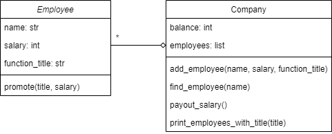

# Exam Scientific Programming 2

Date: December 20 2022

This is a digital exam. The exam consists of 3 assignments in which you have to write a short python program.

You're only evaluated based on the _correctness_ of your solutions, code design is not important. So, you don't have to worry about comments or the style guide.

You can test your code using checkpy. First download the tests for the exam:

    checkpy -d /spcourse/exam-tests

Run checkpy:

    checkpy sp2_exam6

# Rules

- Create one file for all your solutions called `sp2_exam6.py`. This is the file you'll hand in at the end of your exam.
- You're only allowed to use the websites sp1.mprog.nl/sp2.mprog.nl (and every website that is directly linked from there).
- You are allowed to look at your own code that you wrote during the course.
- You cannot get any help with programming during the exam.
- Submit your solutions when you're done. **Check with the teacher present if you handed in your assignment correctly before leaving the exam venue.**

### 1. N-intersection
With sets it's relatively easy to compute the intersection between two sets (i.e., create a set with the items that are in both input sets). But it can be useful to compute the intersection between not just two, but an arbitrary number of input sets. Write a function called `n_intersection(sets)`, that takes as input a list of sets (`sets`) and returns the intersection of all of those sets.

Have a look a this example:

    ex1 = n_intersection([{5, 9, 6}, {9, 2, 6}, {6, 5, 9}])
    ex2 = n_intersection([{"kerfuffle", "hullaballoo", "ragamuffin", "flummox"},
                          {"kerfuffle", "ragamuffin", "gobbledygook", "flummox"},
                          {"hullaballoo", "ragamuffin", "gobbledygook", "flummox"},
                          {"hullaballoo", "ragamuffin", "ragamuffin", "gobbledygook", "flummox"}])
    ex3 = n_intersection([])

    print(ex1)
    print(ex2)
    print(ex3)

This should give the following output:

    {9, 6}
    {'ragamuffin', 'flummox'}
    set()

> Tip: `set()`, just means an empty set. This cannot be written as `{}` because that's already used in python for an empty dictionary.

### 2. Distribution
We have a dictionary containing the grades of students for a specific test. We would like to generate a distribution of grades for that class (i.e., an overview showing the frequency of each grade.)

Write a function called `calculate_distribution(grades)` that takes a dictionary of students grade and returns a dictionary showing how often each grade was given.

You may assume that grades are on a scale of 1 to 10, and that grades are always whole numbers (integers). So the possible grades are: 1, 2, 3, 4, 5, 6, 7, 8, 9, and 10.

Have a look at this example:

    grades1 = {'Albert': 7, 'Marie': 9, 'Olivier': 7, 'Tom': 9, 'Elio': 7}
    grades2 = {'Albert': 3, 'Marie': 8, 'Olivier': 8, 'Tom': 8, 'Elio': 9}
    dist1 = calculate_distribution(grades1)
    dist2 = calculate_distribution(grades2)
    print(dist1)
    print(dist2)

This should produce the following output:

    {1: 0, 2: 0, 3: 0, 4: 0, 5: 0, 6: 0, 7: 3, 8: 0, 9: 2, 10: 0}
    {1: 0, 2: 0, 3: 1, 4: 0, 5: 0, 6: 0, 7: 0, 8: 3, 9: 1, 10: 0}

See for example that the first dictionary shows that in `grades1` three students got a 7.

### 3. Company
You and your friends start a company with a small loan of a million dollars. To keep track of employees, their salaries, and company funds you will implement two classes: `Employee`, and `Company`. `Employee` is a class that contains all relevant information about an employee. In our case, this is their name, their salary, and their function title. The `Employee` class also has a method which can be used to change the salary and function title of an employee. The class `Company` is a container for the list of employees that are currently employed and the company balance. This class implements three different methods that can be used to add employees, pay the salary of every employee, and to print all employees with a specific function title.

The following UML describes these classes and their relation:

Implement `Employee` with the following methods:

- `__init__(name, salary, function_title)`: create a new instance with the information provided by the parameters
- `promote(title, salary)`: change the `function_title` and the `salary` of the `Employee` this method was called on.

Implement `Company` with the following methods:

- `__init__(balance)`: create a new instance with the balance provided in the parameters. Also initialize relevant instance attributes.
- `add_employee(name, salary, function_title)`: create a new employee instance using the parameters. Then add the instance to the list of employees.
- `find_employee(name)`: search the list of employees for an employee with that exact `name`. Return the `Employee` instance if found, and `None` otherwise. You may assume that all employee names are unique.
- `payout_salary()`: determine the total salary payout for one month. Print this total and subtract it from the company balance. You don't need to check if the company has enough money (i.e., the balance can become negative).
- `print_employees_with_title(function_title)`: print the names of all employees with a specific title (see the example below for the format).

Have a look at this example:

    trump_co = Company(1000000)

    trump_co.add_employee('Fleur Kleur', 12000, 'CEO')
    trump_co.add_employee('Stacy de Wit', 1812, 'Secretary')
    trump_co.add_employee('Bart Zwart', 2147, 'Secretary')
    trump_co.add_employee('Danielle Groen', 3540, 'Manager')
    trump_co.add_employee('Kees de Bruin', 4800, 'Sales executive')
    trump_co.add_employee('Mart van Oranje', 1990, 'Secretary')

    print(f'Started the company with: {trump_co.balance}')
    trump_co.payout_salary()
    print(f'Balance after first salary: {trump_co.balance}')

    print()
    trump_co.print_employees_with_title('Secretary')

    stacy = trump_co.find_employee('Stacy de Wit')
    print()
    print(f'Found {type(stacy)} named {stacy.name} with a salary of {stacy.salary} and with title {stacy.function_title}.')

    stacy.promote('Manager', 2900)
    print()
    print(f'{stacy.name} has been promoted to {stacy.function_title}! Her new salary is {stacy.salary}.')

    print()
    trump_co.print_employees_with_title('Secretary')

Which should give the following result:

    Started the company with: 1000000
    Salary total: 26289
    Balance after first salary: 973711

    Listing all employees with title Secretary:
    - Stacy de Wit
    - Bart Zwart
    - Mart van Oranje

    Found <class '__main__.Employee'> named Stacy de Wit with a salary of 1812 and with title Secretary.

    Stacy de Wit has been promoted to Manager! Her new salary is 2900.

    Listing all employees with title Secretary:
    - Bart Zwart
    - Mart van Oranje
