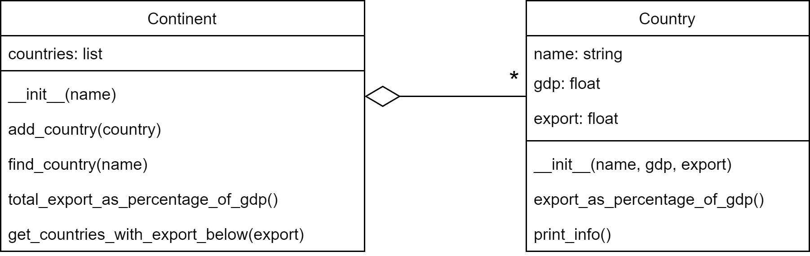

# Exam Scientific Programming 2

Date: March 29 2023

This is a digital exam. The exam consists of 3 assignments in which you have to write a short python program.

You're only evaluated based on the _correctness_ of your solutions, code design is not important. So, you don't have to worry about comments or the style guide.

You can test your code using checkpy. First download the tests for the exam:

    checkpy -d /spcourse/exam-tests

Run checkpy:

    checkpy sp2_exam7

# Rules

- Create one file for all your solutions called `sp2_exam7.py`. This is the file you'll hand in at the end of your exam.
- You're only allowed to use the websites sp1.mprog.nl/sp2.mprog.nl (and every website that is directly linked from there).
- You are allowed to look at your own code that you wrote during the course.
- You cannot get any help with programming during the exam.
- Submit your solutions when you're done. **Check with the teacher present if you handed in your assignment correctly before leaving the exam venue.**

### 1. Lemmas

Create a function named `count_lemmas(text, lemmas)`. The function should count the occurrences of each `lemma` (base form of a word) in the given `text` and return the result as a dictionary.

> A lemma is a base form of a word that serves as a canonical representation of a set of words that have similar meanings. For example, the lemma of "run," "running," and "ran" is "run." In the given code, the lemmas parameter is a dictionary that maps the variations of a word to its lemma.

The text parameter is a string containing the text to be analyzed. The function should split (use `.split()`) the text into words; remove any punctuation marks (use `.strip()`); and convert to lowercase (`.lower()`). If the word exists in the `lemmas` dictionary, count the lemma, not the word itself.

Example usage:

    text = "He is, was and will be a runner. And runners ran, run and will always run. This is their nature."

    lemmas = {
        "runners": "runner",
        "ran": "run",
        "was": "be",
        "is": "be"
    }

    print(count_lemmas(text, lemmas))

Expected output:

    {'he': 1, 'be': 4, 'and': 3, 'will': 2, 'a': 1, 'runner': 2, 'run': 3, 'always': 1, 'this': 1, 'their': 1, 'nature': 1}

### 2. Grammatical categories

Create a function called `count_category(lemma_counts, category)`. This function counts the occurances of lemmas of a specific grammatical category (for example verbs or nouns). The input is `lemma_counts`, a dictionary of lemma counts like you created in the last assignment, and `category` a set of words representing a grammatical category.

(If you didn't finish the previous assignment, no worries, the correct `lemma_counts` dictionary is provided below.)

Example usage:

    lemma_counts = {'he': 1, 'be': 4, 'and': 3, 'will': 2, 'a': 1, 'runner': 2, 'run': 3, 'always': 1, 'this': 1, 'their': 1, 'nature': 1}
    nouns = {'runner', 'nature', 'building'}
    verbs = {'walk', 'run', 'be'}
    determiners = {'the', 'a', 'this', 'their'}

    print(count_category(lemma_counts, nouns))
    print(count_category(lemma_counts, verbs))
    print(count_category(lemma_counts, determiners))

Expected output:

    3
    7
    3

### 3. Export

In this assignment, you will implement two classes, `Country` and `Continent`, to model countries and continents in a simple data analysis scenario. You will be provided with test code that uses these classes, and your task is to write the classes so that the test code runs correctly.

The `Country` class should have three attributes:

* `name`: a string representing the name of the country
* `gdp`: a float representing the country's gross domestic product (GDP) in millions of dollars
* `export`: a float representing the country's total exports in millions of dollars

It should also have a method `export_as_percentage_of_gdp()` that returns the percentage of the country's GDP that its exports represent.

The `Continent` class should have two attributes:

* `name`: a string representing the name of the continent
* `countries`: a list representing the Country objects that belong to the continent

It should also have the following methods:

* `add_country(country)`: adds a Country object to the list of countries
* `find_country(name)`: returns the Country object with the given name, or None if it is not found
* `total_export_as_percentage_of_gdp()`: returns the total export of all countries in the continent as a percentage of the total GDP of those countries
* `get_countries_with_export_below(export)`: returns a list of Country objects whose exports are below the given threshold

The following UML describes these classes and their relation:

The following code should work correctly with your classes:

    asia = Continent("Asia")
    europe = Continent("Europe")

    # Data 2021 worldbank.org (in millions of dollars)

    europe.add_country(Country("Italy",   2107702.84,   688582.42))
    europe.add_country(Country("France",  2957879.76,   871058.67))
    europe.add_country(Country("U.K.",    3131377.76,   875196.92))
    europe.add_country(Country("Germany", 4259934.91,  2003471.01))
    europe.add_country(Country("Spain",   1427380.68,   498633.85))

    asia.add_country(Country("Kazakhstan", 197112.26,    66124.96))
    asia.add_country(Country("India",     3176295.07,   679680.59))
    asia.add_country(Country("Mongolia",    15286.44,     8950.04))
    asia.add_country(Country("China",    17734062.65,  3553509.24))
    asia.add_country(Country("Indonesia", 1186092.99,   255731.27))

    kazakhstan = asia.find_country("Kazakhstan")
    kazakhstan.print_info()
    print()

    print("European countries with export below $ 700.000M")
    countries = europe.get_countries_with_export_below(700000)
    for country in countries:
        country.print_info()
    print()

    print(f"Total export as % of gdp asia: {asia.total_export_as_percentage_of_gdp():.2f}")

Expected output:

    Country: Kazakhstan; gdp: 197112.26; export: 66124.96; export as % of gdp: 33.54685294562601

    European countries with export below $ 700.000M
    Country: Italy; gdp: 2107702.84; export: 688582.42; export as % of gdp: 32.66980557847519
    Country: Spain; gdp: 1427380.68; export: 498633.85; export as % of gdp: 34.933487400151726

    Total export as % of gdp asia: 20.46
