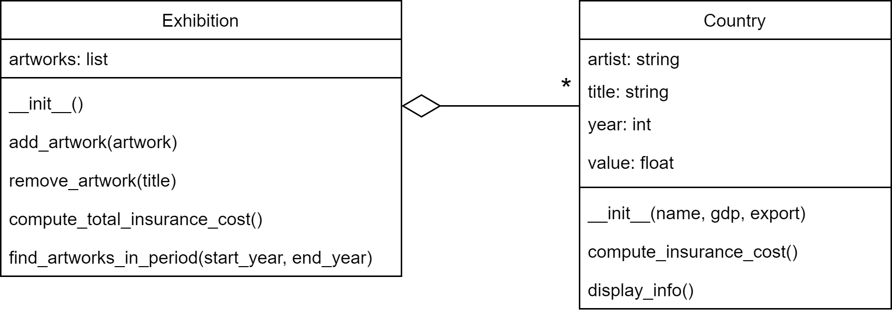

# Exam Scientific Programming 2

Date: June 1 2023

This is a digital exam. The exam consists of 3 assignments in which you have to write a short python program.

You're only evaluated based on the _correctness_ of your solutions, code design is not important. So, you don't have to worry about comments or the style guide.

You can test your code using checkpy. First download the tests for the exam:

    checkpy -d /spcourse/exam-tests

Run checkpy:

    checkpy sp2_exam8

# Rules

- Create one file for all your solutions called `sp2_exam8.py`. This is the file you'll hand in at the end of your exam.
- You're only allowed to use the websites sp1.mprog.nl/sp2.mprog.nl (and every website that is directly linked from there).
- You are allowed to look at your own code that you wrote during the course.
- You cannot get any help with programming during the exam.
- Submit your solutions when you're done. **Check with the teacher present if you handed in your assignment correctly before leaving the exam venue.**

### 1. Frequency

Write a function called `letter_frequency(text)` that calculates the relative frequency of letters in a given text. The function should return the frequencies in the form of a dictionary. The function should be case-insensitive and only consider alphabetic letters.

Example usage:

    print(letter_frequency("Hello, world"))
    print(letter_frequency("Glowing unicorns great."))

Expected output:

    {'h': 0.1, 'e': 0.1, 'l': 0.3, 'o': 0.2, 'w': 0.1, 'r': 0.1, 'd': 0.1}
    {'g': 0.15, 'l': 0.05, 'o': 0.1, 'w': 0.05, 'i': 0.1, 'n': 0.15, 'u': 0.05, 'c': 0.05, 'r': 0.1, 's': 0.05, 'e': 0.05, 'a': 0.05, 't': 0.05}

Explanation: In the first example, "Hello, world", the relative frequency of 'h' is 0.1 because it occurs once out of a total of 10 letters. The letter 'l' occurs three times, resulting in a relative frequency of 0.3.

### 2. Common

Write a Python function `find_common_elements(list1, list2)`, that takes in two lists and returns a dictionary containing common elements between the lists as keys and their respective frequencies as values. The frequency of an element is the number of times it appears in both lists combined.

Example Usage:

    list1 = [1, 2, 3, 4, 5]
    list2 = [4, 5, 5, 7, 8]
    result = find_common_elements(list1, list2)
    print(result)

Output:

    {4: 2, 5: 3}

### 3. Exhibition

You'll be writing small python program to manage an exhibition of famous artworks. You'll be creating an `Artwork` class and an `Exhibition` class. The `Artwork` class represents individual artworks, allowing users to store information about the artist, title, year of creation, and value. It also provides methods to compute the insurance cost of an artwork and display its information.

The `Exhibition` class allows users to create and manage a collection of artworks. Users can add or remove artworks from the exhibition. The class provides a method to compute the total insurance cost for all artworks in the exhibition. Additionally, users can find artworks within a specific time period using the `find_artworks_in_period` method, which takes a start year and an end year as arguments and returns a list of artworks created within that time period.

By implementing these classes, users can easily create, manage, and analyze collections of artworks, computing insurance costs and filtering artworks based on their creation years.

#### Artwork Class

The `Artwork` class represents a piece of artwork.

Attributes:

- `artist`: The name of the artist.
- `title`: The title of the artwork.
- `year`: The year of creation.
- `value`: The monetary value of the artwork in dollars.

Methods:

- `compute_insurance_cost()`: Computes the insurance cost for the artwork based on its value. The insurance cost is **2% of the value of the artwork**.
- `display_info()`: Displays information about the artwork, including the title, artist, year, and value.

#### Exhibition Class

The `Exhibition` class manages a collection of artworks.

Attributes:

- `artworks`: A list that holds the artworks in the exhibition.

Methods:

- `add_artwork(artwork)`: Adds an artwork to the exhibition.
- `remove_artwork(title)`: Removes an artwork from the exhibition based on its title.
- `compute_total_insurance_cost()`: Computes the total insurance cost for the entire exhibition.
- `find_artworks_in_period(start_year, end_year)`: Finds all artworks within a specific time period.

The following UML describes these classes and their relation:

The program should work with the following example code:

    # Create an exhibition
    exhibition = Exhibition()

    # Add artworks to the exhibition
    artwork1 = Artwork("Leonardo da Vinci", "Mona Lisa", 1503, 100000000)
    artwork2 = Artwork("Vincent van Gogh", "Starry Night", 1889, 80000000)
    artwork3 = Artwork("Pablo Picasso", "Les Demoiselles d'Avignon", 1907, 120000000)
    artwork4 = Artwork("Salvador Dali", "The Persistence of Memory", 1931, 60000000)
    exhibition.add_artwork(artwork1)
    exhibition.add_artwork(artwork2)
    exhibition.add_artwork(artwork3)
    exhibition.add_artwork(artwork4)

    # Compute total insurance cost for the exhibition
    total_insurance_cost = exhibition.compute_total_insurance_cost()
    print(f"The total insurance cost for the exhibition is ${total_insurance_cost:.2f}")

    # Find artworks within a specific time period

    print()
    artworks_in_period = exhibition.find_artworks_in_period(1800, 1920)
    print(f"Artworks within the period 1800-1920:")
    for artwork in artworks_in_period:
        artwork.display_info()

